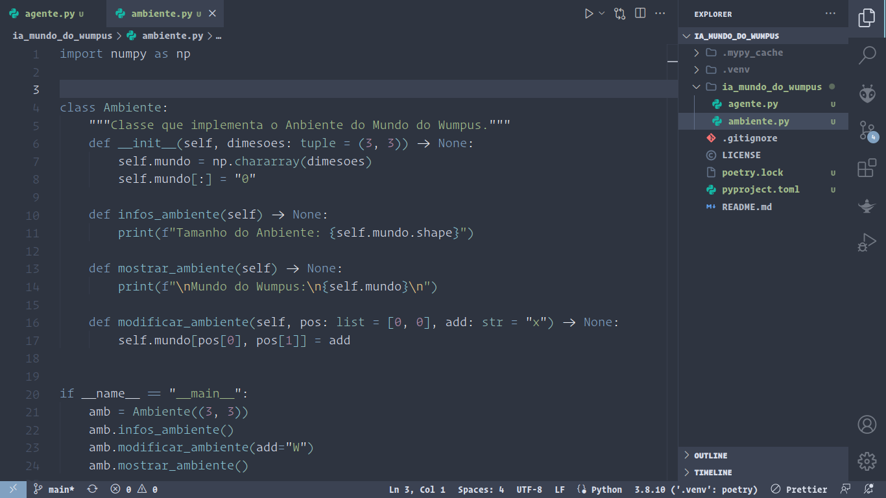

    

<strong>Universidade Federal do Pará</strong>

<strong>Campus Universitário de Tucuruí</strong>

<strong>Faculdade de Engenharia Elétrica</strong>

 

# Mundo do Wumpus - Intelegência Computacional

Ambiente para estudo de modelos de Apredizagem de Máquina da disciplina de Inteligência Computacional.

 

# Versões do Projeto

## [Link Versão 00](https://github.com/Oseiasdfarias/IA_mundo_do_wumpus/tree/versao_0)

**Etapa 1 - Gerador Aleatório de Ambientes do Mundo do Wumpus.**

<ul>
  <li>Tamanho (n) = ordem(n) da matriz quadrada (n >= 3). Linha e coluna = (n - 1);</li>
  <li>Objetos: poços (p), Wumpus (W) e ouro (o). Quantidade? [São parâmetros definidos pelo usuário (p, W, o >= O). E, também, podem ser atribuídos automaticamente, de acordo com o tamanho do ambiente (n), via a definição de alguma regra].</li>
  <li>A partir dos objetos, posicionar no ambiente, também, as percepções geradas por cada um deles.</li>
  <li>A casa (0,0) é a única que não pode ter nenhum objeto, pois é a posição inicial do Agente</li>
  <li>Onde houver poço não pode ser posicionado o ouro e o Wumpus. No entanto, estes podem ser posicionados em quaisquer uma das outras casas.</li>
</ul>

 

## [Link Versão 01](https://github.com/Oseiasdfarias/IA_mundo_do_wumpus/tree/versao_1)

**Etapa 2 - Agente Reativo (Versão 1).**

<ul>
  <li>O comportamento do Agente é definido a partir de seu conjunto de regras:</li>
  <ul>
      <li>Se < percepções > então < ação >.</li>
    </ul>
  <li>Este conjunto de regras (ou Base de Conhecimento) deve ser especificado por meio de uma tabela, aos moldes da que foi especificada, inicialmente, na “Aula 04';</li>
  <li>A partir da especificação, o próximo passo é codificar o Agente e integrar ao “Gerador Aleatório de Ambientes, de forma a ossibilitar a realização de testes de validação para posterior avaliação de performance;</li>
  <li>Obs.: Serão projetadas várias versões deste Agente. Nesta primeira versão, ele utiliza apenas o conjunto de regras como base de conhecimento. Ou seja, não tem memória e nenhum outro mecanismo mais sofisticado para escolher qual das possíveis regras utilizar. Para isto, deve ser uma escolha aleatória. Além disso, ele tem apenas uma única flecha.</li>
</ul>

 

## [Link Versão 02](https://github.com/Oseiasdfarias/IA_mundo_do_wumpus/tree/versao_2)

**Etapa 3 - Agente Reativo (Versão 2).**

<ul>
  <li>Esta versão engloba a versão 1 e, mais, aos moldes do “Modelo Linear de Estruturas de Agentes”;</li>
  <li>Estrutura de memória, que pode ser: uma lista; uma matriz - réplica do ambiente, com anotações feitas pelo agente; ou, outra estrutura de dados definida como mais adequada pela equipe;</li>
  <li>Mecanismo mais inteligente para escolha da regra a ser aplicada, em caso de duas ou mais possíveis de serem utilizadas em determinado instante. Na primeira versão foi utilizada a Estratégia Aleatória. Logo, há liberdade para definir a melhor estratégia para essa finalidade;</li>
  <li>Além disso, uso do conhecimento registrado na memória para auxiliar o processo de escolha da regra a ser aplicada (Inferência? Planejamento?);</li>
  <li>Além disso, uso do conhecimento registrado na memória para auxiliar o processo de escolha da regra a ser aplicada (Inferência? Planejamento?);</li>
  <li>E o que mais a equipe deseje projetar: “- Usem as vossas criatividades”</li>
  <li>Ao final, após o projeto deste Agente, pede-se que este seja classificado de acordo com as estruturas de agentes e justificada a classificação.</li>
</ul>

 

    

