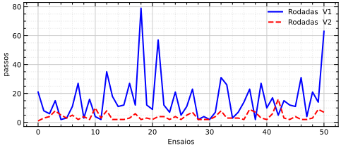
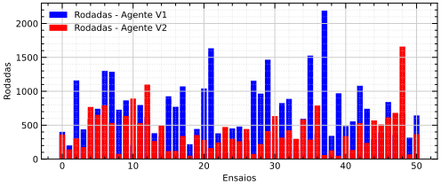
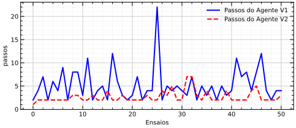
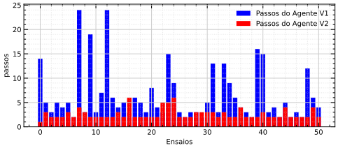
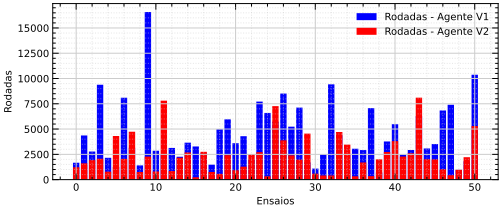

# Resultados e Discursões

Com os **Agente Reatico** **V1 e V2** implementados, agora podemos realizar simulações afim de compara-los. para isso, usamos o mesmo ambiente para ambos os agentes, assim podemos obter dados que podem ser comparados e analisados afim de obter os desenpenhos dos agentes em questão.

Os simulações contêm duas informações principais, a primeira e a quantidade de rodadas necessária para o agente vencer uma partida e a segunda informação é a quantidade de passos dados na rodada que o agente venceu.

Além disso, para realiza uma análise mais robusta, vamos executar o algorítimo até que o agente obtenha 50 vitorias para ambos os agentes.

## Simulação 50 Vitórias, Ambiente (3x3)

#### Execificação do Ambiente e Objetos

    Qt. Agente: 1
    Qt. Wumpus: 1
    Qt. Poços: 5
    Qt. Ouro: 1

#### Dados estatísticos

- **Gráfico das rodadas (V1 vs V2)**

- **Gráfico dos passos (V1 vs V2)**

- Média rodadas V1: **6.15** 
- Média rodadas V2: **9.58**
- Médias de Passos V1: **3.49**
- Médias de Passos V2: **2.17** 

## Simulação 50 Vitórias, Ambiente (5x5)

#### Execificação do Ambiente e Objetos

    Qt. Agente: 1
    Qt. Wumpus: 1
    Qt. Poços: 5
    Qt. Ouro: 1

#### Dados estatísticos

- **Gráfico das rodadas (V1 vs V2)**

- **Gráfico dos passos (V1 vs V2)**

- Média rodadas V1: **42.39** 
- Média rodadas V2: **34.88**
- Médias de Passos V1: **16.07**
- Médias de Passos V2: **4.15** 

## Simulação 50 Vitórias, Ambiente (15x15)

#### Execificação do Ambiente e Objetos

    Qt. Agente: 1
    Qt. Wumpus: 1
    Qt. Poços: 15
    Qt. Ouro: 1

#### Dados estatísticos

- **Gráfico das rodadas (V1 vs V2)**

- **Gráfico dos passos (V1 vs V2)**

- Média rodadas V1: **705.17** 
- Média rodadas V2: **409.86**
- Médias de Passos V1: **5.23**
- Médias de Passos V2: **2.64** 

## Simulação 50 Vitórias, Ambiente (25x25)

#### Execificação do Ambiente e Objetos

    Qt. Agente: 1
    Qt. Wumpus: 1
    Qt. Poços: 25
    Qt. Ouro: 1

#### Dados estatísticos

- **Gráfico das rodadas (V1 vs V2)**

- **Gráfico dos passos (V1 vs V2)**

- Média rodadas V1: **2675.21** 
- Média rodadas V2: **1697.98**
- Médias de Passos V1: **6.54**
- Médias de Passos V2: **2.60** 

## Simulação 50 Vitórias, Ambiente (35x35)

#### Execificação do Ambiente e Objetos

    Qt. Agente: 1
    Qt. Wumpus: 1
    Qt. Poços: 35
    Qt. Ouro: 1

#### Dados estatísticos

- **Gráfico das rodadas (V1 vs V2)**

- **Gráfico dos passos (V1 vs V2)**

- Média rodadas V1: **5613.72** 
- Média rodadas V2: **4659.00**
- Médias de Passos V1: **9.25**
- Médias de Passos V2: **3.90** 

